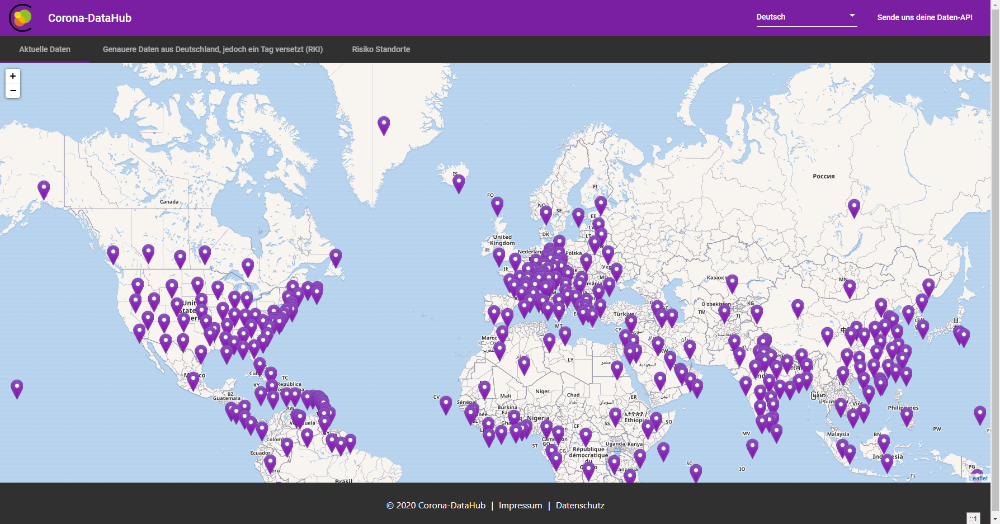
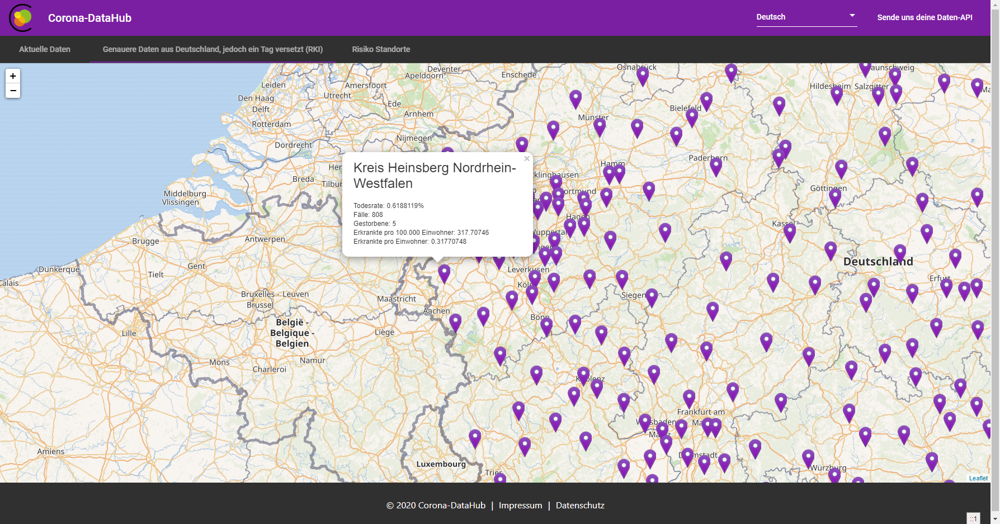

# Corona-DataHub  
This solution was developed for the Hackathon **#WirVsVirus**. The goal of the system is to help other people and to inform them about the current Corona cases. The system also aims to show people at what times you should avoid certain public places.  

We have created a platform to clarify where you shouldn't be at any point in time. This is to minimize the risk of getting infected.

# Get Started   
First, clone the project into any directory with a Git client.

Run `ng serve` for a dev server. Navigate to `http://localhost:4200/`. The app will automatically reload if you change any of the source files.

Happy coding! :)

## Production Build
Run `ng build` to build the project. The build artifacts will be stored in the `dist/` directory. Use the `--prod` flag for a production build.

# Built With 
-  [Angular](https://angular.io/docs) - The web framework used  
	 - [NG-Bootstrap](https://ng-bootstrap.github.io/#/home)
	 - [Bootstrap](https://getbootstrap.com/)  
	 - [Leaflet](https://leafletjs.com/reference-1.6.0.html)
	 - [Material Angular](https://material.angular.io/guide/theming)
-  [Spark Java](http://sparkjava.com/documentation) - The RestAPI for the web application  
-  [RethinkDB](https://rethinkdb.com/docs) - The database in which the data is stored and 

# Demo-Images

  
# Contributors  
 - [Florian Z.](https://github.com/Gomze) - @Gomze  
 - [Nils G.](https://github.com/MrCodingMen) - @MrCodingMen  
 - [Julian H.](https://github.com/Newspicel) - @Newspicel  
 - [Lukas R.](https://github.com/DevAvery) - @DevAvery  
 - [Dennis B.](https://github.com/einDeveloper) - @einDeveloper  
 - [Chris S.](https://github.com/c-sakel) - @c-sakel  
 - [Patrick Z.](https://github.com/Paddy00777) - @Paddy00777  
 - [Pascal H.](https://github.com/byPascii) - @byPascii  
  
# License  
This project is licensed under the **GNU General Public License v3.0** see the [LICENSE](https://github.com/CoronaDataHub/Frontend/blob/master/LICENSE) file for details
